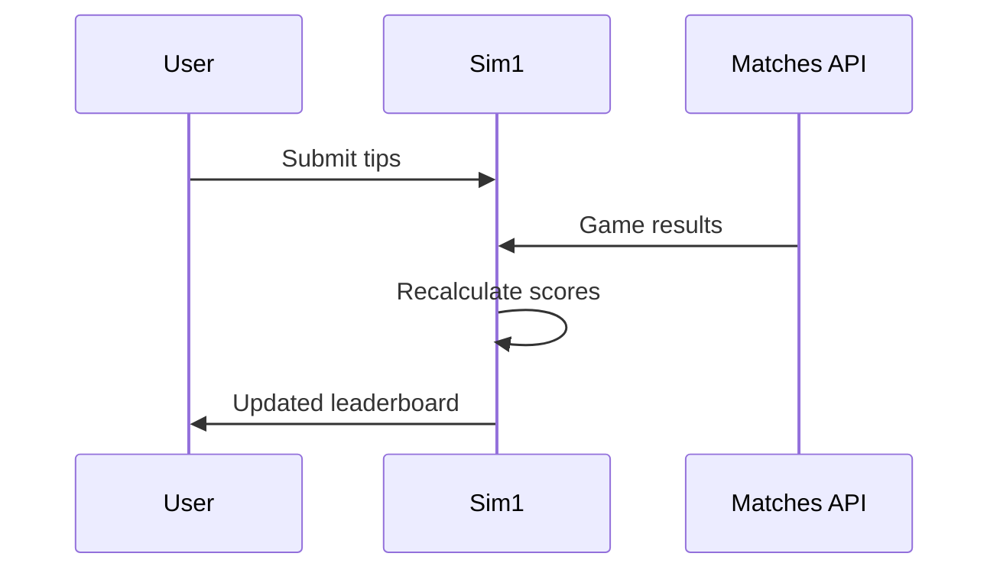

## Overview

Sim1 empowers you to create and manage tip competitions for sports leagues, tournaments, and events like the Bundesliga, Premier League, or World Cups. Track predictions, scores, and leaderboards in real-time while inviting friends, colleagues, or teams to join. Customize rounds, update results, and view analytics effortlessly from the dashboard.

## Key Features

<Columns cols={2}>
  <Card title="Custom Tip Rounds" icon="plus-circle" href="#create-tip-rounds">
    Build tip rounds for any league or tournament with custom rules and deadlines.
  </Card>
  <Card title="Invite Participants" icon="users" href="#invite-participants">
    Share via email invites or unique links for seamless onboarding.
  </Card>
  <Card title="Real-time Leaderboards" icon="trending-up" href="#real-time-leaderboards">
    Watch scores update live as games progress.
  </Card>
  <Card title="Game Management" icon="settings" href="#manage-games">
    Handle ongoing matches, results, and adjustments centrally.
  </Card>
</Columns>

## Create Custom Tip Rounds

Follow these steps to set up a new tip round in your Sim1 dashboard.

<Steps>
  <Step title="Choose Event Type" icon="calendar">
    Navigate to the dashboard at `https://dashboard.sim1.app` and select "New Tip Round".
    
    Pick from leagues like Bundesliga or create a custom tournament.
  </Step>
  <Step title="Set Rules and Deadline" icon="edit-3">
    Define scoring rules (e.g., 3 points for exact score) and match deadlines.
  </Step>
  <Step title="Save and Publish" icon="check-circle">
    Review details and publish. Get a unique round ID like `round_abc123`.
  </Step>
</Steps>

<Callout kind="tip">
  Start with public rounds for practice before inviting private groups.
</Callout>

## Invite Participants

Choose your preferred method to bring others into your tip round.

<Tabs>
  <Tab title="Email Invites" icon="mail">
    From the dashboard:
    
    1. Go to your tip round settings.
    2. Enter participant emails.
    3. Send personalized invites with join links.
    
    Participants receive an email like:
    
    ```
    Join my Bundesliga tip round: https://sim1.app/join/round_abc123?token=xyz789
    ```
  </Tab>
  <Tab title="Share Links" icon="share-2">
    Generate a shareable link instantly.
    
````javascript
// Example API call to generate invite link
const response = await fetch('https://api.sim1.app/v1/rounds/round_abc123/invites', {
  method: 'POST',
  headers: { 'Authorization': 'Bearer YOUR_API_KEY' },
  body: JSON.stringify({ max_uses: 50 })
});
const { invite_url } = await response.json();
console.log(invite_url); // https://sim1.app/join/round_abc123?invite=def456
````
  </Tab>
</Tabs>

## Real-time Leaderboards

Sim1 updates leaderboards automatically as match results come in. View top predictors, total points, and accuracy stats.

| Rank | User | Points | Win Rate | Matches Tipped |
|------|------|--------|----------|---------------|
| 1    | Alice | 245    | 78%     | 32            |
| 2    | Bob   | 231    | 72%     | 32            |
| 3    | Carol | 218    | 68%     | 32            |

<Callout kind="info">
  Leaderboards refresh every 30 seconds during live games.
</Callout>



## Manage Ongoing Games and Results

Handle live events with full control.

<Expandable title="Advanced Management Options" default-open="false">
  Update results manually if needed:
  
  <ParamField path="round_id" param-type="string" required="true">
    Your tip round identifier (e.g., `round_abc123`).
  </ParamField>
  
  <ParamField body="home_score" param-type="number" required="false">
    Home team goals.
  </ParamField>
  
  <ParamField body="away_score" param-type="number" required="false">
    Away team goals.
  </ParamField>
  
  Use the API endpoint:
  
````bash
curl -X POST https://api.sim1.app/v1/rounds/round_abc123/results \
  -H "Authorization: Bearer YOUR_API_KEY" \
  -d '{"match_id": "match_123", "home_score": 2, "away_score": 1}'
````
</Expandable>

These features make Sim1 ideal for casual games or competitive leagues. Explore the [quickstart](/quickstart) for your first round.